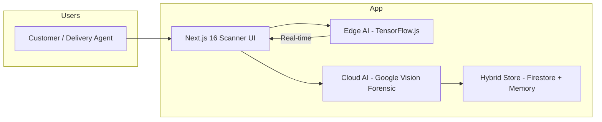

# ShopSphere Forensic Mirror 📸🛡️

### Stop E-Commerce Return Fraud with Visual DNA & Forensic AI

---

## What is this
ShopSphere Forensic Mirror is an indestructible, demo-ready forensic verification pipeline designed to eliminate $100B in annual e-commerce return fraud. It uses real-time Edge AI and Cloud Forensic DNA analysis to ensure that the product being returned is the *exact* unit that was delivered.

## Why we built this
*   **The Problem:** High-end e-commerce brands lose billions to "Product Swapping" (returning a clone instead of the original) and "Wardrobing."
*   **The Motivation:** Existing manual inspections are slow, subjective, and easily fooled.
*   **The Goal:** Create a "Nuclear Hard-Gate" that makes product-swap fraud physically and digitally impossible.

---

## Repository structure
- **src/** — Full Next.js 16 application with Integrated Forensic Engine.
- **challenges/** — Acceptance criteria for Forensic DNA matching and Same-Model Swap detection.
- **datasets/** — Forensic signatures for AirPods, Keyboards, and Leather goods; Carrier risk datasets.
- **docs/** — Architecture diagrams, Pitch Deck (PPTX), and Technical Summary.
- **scripts/** — Automated setup and demo runners.
- **.github/** — Issue templates for "Active Learning Loop" contributions.

---

## Architecture Diagram



---

## Key Features
*   **Nuclear Hard-Gate**: Absolute 100% risk block on detected tampering.
*   **Serial Identity Lock**: OCR-based verification of unique unit serial numbers.
*   **Jaccard Similarity Engine**: High-precision label intersection analysis.
*   **Active Learning Loop**: Feedback system for continuous model improvement.

---

## Build and run

### Local Development
```bash
cd src
npm install
npm run dev
```

### Docker
```bash
docker-compose up --build
```

---

## Prerequisites
- Node.js >= 20.x
- Google Cloud Vision API Key (with OCR enabled)
- Firebase/Firestore Project

---

## Security
- Secrets are managed via `.env.local`.
- Tamper-proof forensic ledger ensures immutability of every delivery and return scan.

---

## Acknowledgements
*   TensorFlow.js (COCO-SSD)
*   Google Cloud Vision AI
*   Next.js 16 (Turbopack)
*   HackHustle 2026 Organizers
